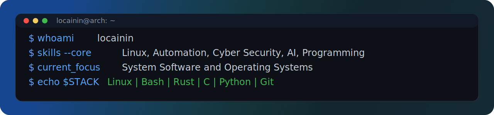

  <!-- Local hero banner image. -->
  

  

  

## Missions and Goals
<!--
- Building Practical Software With A Focus On Optimization.
- Focused on System-level Work, Automation, and Cyber Security
- Prioritizing Performance, Maintainability, and Security
-->

  <picture>
    <source media="(prefers-color-scheme: dark)" srcset="./assets/missions-goals-dark.png" />
    
  </picture>

## Languages and Skills
<!-- Tool icons use PNG for reliable GitHub rendering. -->

  
  
  
  
  
  
  
  
  
  

## Live Stats

  

  

  

  

